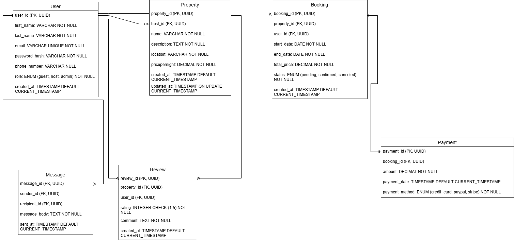

# ALX Airbnb Database - Entity-Relationship Diagram Requirements

This document outlines the entities, attributes, and relationships designed for the ALX Airbnb-like application database. The visual representation of this ERD is provided in `alx-airbnb-erd.png` within this directory.

## Entities and Attributes:

* **User**
    * `user_id`: Primary Key, UUID, Indexed
    * `first_name`: VARCHAR, NOT NULL
    * `last_name`: VARCHAR, NOT NULL
    * `email`: VARCHAR, UNIQUE, NOT NULL
    * `password_hash`: VARCHAR, NOT NULL
    * `phone_number`: VARCHAR, NULL
    * `role`: ENUM (guest, host, admin), NOT NULL
    * `created_at`: TIMESTAMP, DEFAULT CURRENT_TIMESTAMP

* **Property**
    * `property_id`: Primary Key, UUID, Indexed
    * `host_id`: Foreign Key, references User(user_id)
    * `name`: VARCHAR, NOT NULL
    * `description`: TEXT, NOT NULL
    * `location`: VARCHAR, NOT NULL
    * `pricepernight`: DECIMAL, NOT NULL
    * `created_at`: TIMESTAMP, DEFAULT CURRENT_TIMESTAMP
    * `updated_at`: TIMESTAMP, ON UPDATE CURRENT_TIMESTAMP

* **Booking**
    * `booking_id`: Primary Key, UUID, Indexed
    * `property_id`: Foreign Key, references Property(property_id)
    * `user_id`: Foreign Key, references User(user_id)
    * `start_date`: DATE, NOT NULL
    * `end_date`: DATE, NOT NULL
    * `total_price`: DECIMAL, NOT NULL
    * `status`: ENUM (pending, confirmed, canceled), NOT NULL
    * `created_at`: TIMESTAMP, DEFAULT CURRENT_TIMESTAMP

* **Payment**
    * `payment_id`: Primary Key, UUID, Indexed
    * `booking_id`: Foreign Key, references Booking(booking_id)
    * `amount`: DECIMAL, NOT NULL
    * `payment_date`: TIMESTAMP, DEFAULT CURRENT_TIMESTAMP
    * `payment_method`: ENUM (credit_card, paypal, stripe), NOT NULL

* **Review**
    * `review_id`: Primary Key, UUID, Indexed
    * `property_id`: Foreign Key, references Property(property_id)
    * `user_id`: Foreign Key, references User(user_id)
    * `rating`: INTEGER, CHECK: rating >= 1 AND rating <= 5, NOT NULL
    * `comment`: TEXT, NOT NULL
    * `created_at`: TIMESTAMP, DEFAULT CURRENT_TIMESTAMP

* **Message**
    * `message_id`: Primary Key, UUID, Indexed
    * `sender_id`: Foreign Key, references User(user_id)
    * `recipient_id`: Foreign Key, references User(user_id)
    * `message_body`: TEXT, NOT NULL
    * `sent_at`: TIMESTAMP, DEFAULT CURRENT_TIMESTAMP

## Relationships Defined:

* **User (Host) to Property (One-to-Many):**
    * A User can host zero or many Properties.
    * A Property must be hosted by one User.
    * (Connecting `User.user_id` to `Property.host_id`)

* **Property to Booking (One-to-Many):**
    * A Property can have one or many Bookings.
    * A Booking must be for one Property.
    * (Connecting `Property.property_id` to `Booking.property_id`)

* **Booking to Payment (One-to-One):**
    * A Payment must be for one Booking.
    * (Connecting `Booking.booking_id` to `Payment.booking_id`)

* **User to Review (One-to-Many):**
    * A user can write many Reviews.
    * (Connecting `User.user_id` to `Review.review_id`)

* **Property to Review (One-to-Many):**
    * A Property can have many Reviews.
    * (Connecting `Property.property_id` to `Reviewe.review_id`)

* **User to Message (One-to-Many):**
    * Many users can send many messages to many users.
    * (Connecting `User.user_id` to `Message.recipient_id`)

